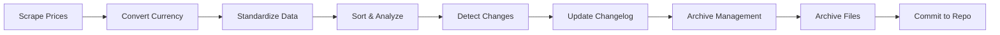

# 🎵 Spotify Global Price Tracker

> Automatically scrape global Spotify subscription prices with real-time currency conversion to find the most affordable regions

[](https://github.com/SzeMeng76/spotify-prices/actions)
[](#)
[](#)

**🌐 Language**: [English](README.md) | [中文](README_zh.md)

## ✨ Core Features

| Feature | Description |
|---------|-------------|
| 🌍 **Global Price Scraping** | Automatically scrape Spotify Premium prices from 50+ countries |
| 💱 **Real-time Currency Conversion** | Integrated exchange rate API, convert all prices to CNY in real-time |
| 🏆 **Smart Sorting & Analysis** | Sort by Premium Family prices, instantly find the cheapest subscription regions |
| 📊 **Standardized Data** | Multi-language plan name standardization (e.g., "Premium Familiar" → "Premium Family") |
| 🎯 **Ranking System** | **NEW!** Top 10 rankings for monthly and prepaid plans with detailed price comparison |
| 💳 **Prepaid Plan Support** | **NEW!** Comprehensive support for prepaid subscriptions (1-year, 6-month, etc.) with total cost analysis |
| 🤖 **Automated Execution** | GitHub Actions runs automatically every Sunday, no manual intervention needed |
| 📈 **Historical Data** | Auto-archive by year, supports price trend analysis |
| 📊 **Price Change Tracking** | Automatic detection and logging of price changes with detailed changelog |
| 🗂️ **Smart Archive Management** | Monthly archive system for changelog entries with automatic cleanup |

## 🚀 Quick Start

### Prerequisites
- Python 3.9+
- Free [OpenExchangeRates API Key](https://openexchangerates.org/)

### One-Click Setup
```bash
# 1. Clone the repository
git clone <your-repo-url>
cd spotify-price-tracker

# 2. Install dependencies
pip install -r requirements.txt
playwright install

# 3. Configure API key
cp .env.example .env
# Edit .env file and add your API_KEY

# 4. Run the complete workflow
python spotify.py                    # Scrape price data
python spotify_rate_converter.py     # Convert currency and sort
python changelog_archiver.py         # Archive old changelog entries (monthly)
```

### 🔑 API Key Configuration

**Local Development:**
```bash
# .env file
API_KEY=your_openexchangerates_api_key
```

**GitHub Actions:**
1. Repository Settings → Secrets and variables → Actions
2. Add Secret: `API_KEY` = `your_api_key`

> 💡 **Get Free API Key**: Visit [OpenExchangeRates](https://openexchangerates.org/) to register, 1000 free requests per month

## 🤖 Automation Workflow

### 📅 Scheduled Tasks
- **Runtime**: Every Sunday 8:00 AM Beijing Time
- **Execution**: Price Scraping → Currency Conversion → Change Detection → Archive Management → Data Commit → File Archive
- **Manual Trigger**: Support GitHub Actions manual execution

### 🔄 Workflow Process


## 📊 Data Output

### Main Files
| Filename | Description | Purpose |
|----------|-------------|---------|
| `spotify_prices_all_countries.json` | Raw price data | Data source with complete scraping info |
| `spotify_prices_cny_sorted.json` | CNY sorted data | Analysis results with Top 10 cheapest |
| `CHANGELOG.md` | Price change history | Track all pricing changes with timestamps |
| `price_changes_summary_YYYYMMDD_HHMMSS.json` | Change detection report | Detailed analysis of price variations |

### Featured Data Structure
```json
{
  "_top_10_cheapest_premium_family": {
    "description": "Top 10 cheapest Premium Family plans",
    "updated_at": "2025-08-09",
    "data": [
      {
        "rank": 1,
        "country_name_cn": "Nigeria",
        "price_cny": 11.73,
        "original_price": "₦2,500 / month"
      }
    ]
  },
  "_top_10_cheapest_individual_1year_prepaid": {
    "description": "Top 10 cheapest Premium Individual 1-year prepaid plans",
    "updated_at": "2025-08-09",
    "data": [
      {
        "rank": 1,
        "country_name_cn": "Pakistan",
        "price_cny": 7.37,
        "total_price_cny": 88.4,
        "original_price": "Equivalent to Rs 290.84 per month"
      }
    ]
  },
  "_top_10_cheapest_family_1year_prepaid": {
    "description": "Top 10 cheapest Premium Family 1-year prepaid plans",
    "updated_at": "2025-08-09",
    "data": [
      {
        "rank": 1,
        "country_name_cn": "Brazil",
        "price_cny": 47.22,
        "total_price_cny": 566.64,
        "original_price": "Equivalent to R$40.84 per month"
      }
    ]
  }
}
```

## 🏗️ Project Architecture

```
📦 spotify-price-tracker
├── 🕷️ spotify.py                      # Core scraping engine
├── 💱 spotify_rate_converter.py       # Currency conversion & data processing
├── 📊 price_change_detector.py        # Price change detection system
├── 🗂️ changelog_archiver.py           # Changelog archive management
├── 📋 requirements.txt                 # Python dependencies
├── ⚙️ .env.example                    # Environment variables template
├── 📝 CHANGELOG.md                    # Price change history log
├── 📁 archive/                        # Historical data archive
│   ├── 2025/                         # Organized by year
│   └── 2026/
├── 📁 changelog_archive/              # Monthly changelog archives
│   ├── changelog_2025-07.md          # July 2025 price changes
│   └── changelog_2025-08.md          # August 2025 price changes
├── 🔄 .github/workflows/
│   ├── weekly-spotify-scraper.yml    # Main automation workflow
│   └── manual-test.yml               # Manual testing workflow
├── 📖 README.md                      # English documentation
└── 📖 README_zh.md                   # Chinese documentation
```

## 🌟 Core Features Explained

### 🎯 Multi-Tier Ranking System
Our intelligent ranking system provides comprehensive price analysis:

#### 📊 Monthly Subscription Rankings
- **Premium Family Monthly**: Top 10 most affordable family plans worldwide
- **Premium Individual Monthly**: Best value individual subscriptions
- **Real-time CNY Conversion**: All prices instantly converted for easy comparison

#### 💳 Prepaid Subscription Rankings  
**NEW FEATURE!** Complete analysis of prepaid options with substantial savings:

| Plan Type | Description | Key Benefits |
|-----------|-------------|--------------|
| **Individual 1-Year Prepaid** | Annual individual subscriptions | 💰 Up to 15% savings vs monthly |
| **Family 1-Year Prepaid** | Annual family subscriptions | 👨‍👩‍👧‍👦 Best value for households |
| **6-Month Prepaid** | Mid-term prepaid options | ⚖️ Balance of savings and flexibility |

### 💳 Advanced Prepaid Plan Detection
Automatically identifies and processes prepaid subscriptions:
- **Smart Recognition**: Detects prepaid keywords in multiple languages
- **Total Cost Analysis**: Calculates both monthly average and total prepaid cost
- **Savings Calculator**: Shows exact savings compared to monthly plans
- **Duration Support**: 1-year, 6-month, 3-month prepaid plans

### Multi-language Plan Standardization
Automatically convert localized plan names to unified English standards:

| Original Name | Standardized Name | Region |
|---------------|-------------------|--------|
| Premium para Estudiantes | Premium Student | Spanish |
| Premium Familiar | Premium Family | Spanish |
| Premium 學生 | Premium Student | Chinese |
| Premium 家庭 | Premium Family | Chinese |

### Smart Price Extraction
Support various price formats and promotional information:
- ✅ `$6.49 per month` → Extract 6.49
- ✅ `Después, $6,49*** por mes` → Extract 6.49
- ✅ `First month free, then ¥15/month` → Extract 15.00

### Price Change Detection & Tracking
- 🔍 **Automatic Change Detection**: Compare new prices with historical data to identify changes
- 📝 **Detailed Changelog**: Record all price changes with timestamps and detailed analysis
- 📊 **Change Summary Reports**: Generate comprehensive reports showing price variations
- 🗂️ **Smart Archive System**: Monthly archive management keeps changelog organized

### Historical Data Management
- 📅 Auto-categorize archives by year
- 📈 Support long-term price trend analysis
- 🔄 Smart file migration and organization
- 📆 **Monthly Changelog Archives**: Automatic monthly archive creation for better organization

## 🛠️ Troubleshooting

<details>
<summary>🔍 Common Issues & Solutions</summary>

### Playwright Installation Issues
```bash
# Force reinstall browsers
playwright install --force

# Check installation status
python -c "from playwright.sync_api import sync_playwright; print('✅ Playwright OK')"
```

### API Limit Handling
- ⚠️ Free Account: 1000 requests/month
- 💡 Error Code 429: Too many requests
- 🔄 Solution: Wait for reset or upgrade plan

### GitHub Actions Debugging
```bash
# Check Secrets configuration
GitHub Repo → Settings → Secrets → API_KEY

# View detailed logs
Actions → Select failed workflow → Expand logs
```
</details>

## 📈 Data Examples

### 🏆 Latest Global Rankings

#### 💰 Premium Family Monthly Top 5:
| Rank | Country | Price (CNY) | Original Price |
|------|---------|-------------|----------------|
| 🥇 | Nigeria | ¥11.73 | ₦2,500/month |
| 🥈 | Pakistan | ¥14.67 | Rs 579/month |
| 🥉 | Egypt | ¥16.28 | EGP 109.99/month |
| 4 | Turkey | ¥17.66 | TRY 99.99/month |
| 5 | India | ¥18.80 | ₹229/month |

#### 🎯 Premium Individual 1-Year Prepaid Top 5:
| Rank | Country | Monthly Avg (CNY) | Total Cost (CNY) | Savings |
|------|---------|------------------|------------------|---------|
| 🥇 | Pakistan | ¥7.37 | ¥88.40 | ~50% |
| 🥈 | India | ¥9.40 | ¥112.80 | ~45% |
| 🥉 | Turkey | ¥12.25 | ¥147.00 | ~30% |
| 4 | Brazil | ¥18.85 | ¥226.20 | ~25% |
| 5 | Argentina | ¥21.45 | ¥257.40 | ~20% |

#### 👨‍👩‍👧‍👦 Premium Family 1-Year Prepaid Top 5:
| Rank | Country | Monthly Avg (CNY) | Total Cost (CNY) | Savings |
|------|---------|------------------|------------------|---------|
| 🥇 | Brazil | ¥47.22 | ¥566.64 | ~25% |
| 🥈 | Turkey | ¥52.45 | ¥629.40 | ~20% |
| 🥉 | Argentina | ¥58.90 | ¥706.80 | ~18% |
| 4 | Mexico | ¥65.30 | ¥783.60 | ~15% |
| 5 | India | ¥72.15 | ¥865.80 | ~12% |

> 💡 **Prices for reference only**, actual subscriptions may be subject to regional restrictions

## 🔧 Tech Stack

| Technology | Purpose | Version |
|------------|---------|---------|
|  | Core development language | 3.9+ |
|  | Browser automation | Latest |
|  | Automated deployment | - |
|  | Exchange rate data source | v6 |

## ⚠️ Usage Guidelines

- 📚 **Purpose**: For educational and research purposes only, please comply with website terms of service
- ⏱️ **Frequency**: Built-in delay mechanisms to avoid excessive requests
- 📊 **Accuracy**: Price data is for reference only, official prices prevail
- 🌐 **Limitations**: Some regions may have subscription restrictions

## 🤝 Contributing

Welcome to submit Issues and Pull Requests!

1. Fork this project
2. Create feature branch: `git checkout -b feature/new-feature`
3. Commit changes: `git commit -m 'Add new feature'`
4. Push branch: `git push origin feature/new-feature`
5. Submit Pull Request

## 📝 Changelog

- **v4.0** 🎯 **NEW!** **Advanced Ranking & Prepaid System**: 
  - Added comprehensive ranking system for monthly and prepaid plans
  - Full support for prepaid subscriptions (1-year, 6-month, 3-month)
  - Total cost analysis and savings calculator for prepaid plans
  - Enhanced data structure with prepaid-specific fields
  - Multi-tier comparison system for better decision making
- **v3.3** 🆕 **Price Change Detection System**: Added automatic price change detection, detailed changelog tracking, and monthly archive management
- **v3.2** 🔧 Comprehensive fix for currency detection and price scraping system
- **v3.1** 🌍 Enhanced multilingual plan name recognition for improved data standardization accuracy
- **v3.0** ✨ Multi-language plan name standardization
- **v2.5** 🐛 Fix decimal point price extraction
- **v2.0** 🤖 GitHub Actions automation
- **v1.5** 🔐 Secure API key management
- **v1.0** 🎉 Initial release

> 💡 **New Feature**: Check out [CHANGELOG.md](CHANGELOG.md) for detailed price change history and monthly archives!

## 📄 License

This project is for educational and research purposes only. Please comply with relevant laws and website terms of service.

---

<div align="center">

**🎵 Discover the Best Spotify Subscription Deals Worldwide!**

**🆕 NOW WITH PREPAID RANKINGS!** Find the ultimate savings with our new prepaid plan analysis system.

[🚀 Get Started](#-quick-start) • [🎯 View Rankings](#-data-examples) • [📊 View Data](#-data-output) • [🤖 Automation](#-automation-workflow) • [❓ Issues](https://github.com/SzeMeng76/spotify-prices/issues)

**Language**: [English](README.md) | [中文](README_zh.md)

</div>
