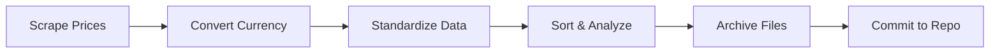

# 🎵 Spotify Global Price Tracker

> Automatically scrape global Spotify subscription prices with real-time currency conversion to find the most affordable regions

[](https://github.com/SzeMeng76/spotify-prices/actions)
[](#)
[](#)

**🌐 Language**: [English](README.md) | [中文](README_zh.md)

## ✨ Core Features

| Feature | Description |
|---------|-------------|
| 🌍 **Global Price Scraping** | Automatically scrape Spotify Premium prices from 50+ countries |
| 💱 **Real-time Currency Conversion** | Integrated exchange rate API, convert all prices to CNY in real-time |
| 🏆 **Smart Sorting & Analysis** | Sort by Premium Family prices, instantly find the cheapest subscription regions |
| 📊 **Standardized Data** | Multi-language plan name standardization (e.g., "Premium Familiar" → "Premium Family") |
| 🤖 **Automated Execution** | GitHub Actions runs automatically every Sunday, no manual intervention needed |
| 📈 **Historical Data** | Auto-archive by year, supports price trend analysis |

## 🚀 Quick Start

### Prerequisites
- Python 3.9+
- Free [OpenExchangeRates API Key](https://openexchangerates.org/)

### One-Click Setup
```bash
# 1. Clone the repository
git clone <your-repo-url>
cd spotify-price-tracker

# 2. Install dependencies
pip install -r requirements.txt
playwright install

# 3. Configure API key
cp .env.example .env
# Edit .env file and add your API_KEY

# 4. Run the complete workflow
python spotify.py                    # Scrape price data
python spotify_rate_converter.py     # Convert currency and sort
```

### 🔑 API Key Configuration

**Local Development:**
```bash
# .env file
API_KEY=your_openexchangerates_api_key
```

**GitHub Actions:**
1. Repository Settings → Secrets and variables → Actions
2. Add Secret: `API_KEY` = `your_api_key`

> 💡 **Get Free API Key**: Visit [OpenExchangeRates](https://openexchangerates.org/) to register, 1000 free requests per month

## 🤖 Automation Workflow

### 📅 Scheduled Tasks
- **Runtime**: Every Sunday 8:00 AM Beijing Time
- **Execution**: Price Scraping → Currency Conversion → Data Commit → File Archive
- **Manual Trigger**: Support GitHub Actions manual execution

### 🔄 Workflow Process


## 📊 Data Output

### Main Files
| Filename | Description | Purpose |
|----------|-------------|---------|
| `spotify_prices_all_countries.json` | Raw price data | Data source with complete scraping info |
| `spotify_prices_cny_sorted.json` | CNY sorted data | Analysis results with Top 10 cheapest |

### Featured Data Structure
```json
{
  "_top_10_cheapest_premium_family": {
    "description": "Top 10 cheapest Premium Family plans",
    "updated_at": "2025-07-26",
    "data": [
      {
        "rank": 1,
        "country_name_cn": "Nigeria",
        "price_cny": 12.34,
        "original_price": "₦1,900 per month"
      }
    ]
  }
}
```

## 🏗️ Project Architecture

```
📦 spotify-price-tracker
├── 🕷️ spotify.py                      # Core scraping engine
├── 💱 spotify_rate_converter.py       # Currency conversion & data processing
├── 📋 requirements.txt                 # Python dependencies
├── ⚙️ .env.example                    # Environment variables template
├── 📁 archive/                        # Historical data archive
│   ├── 2025/                         # Organized by year
│   └── 2026/
├── 🔄 .github/workflows/
│   ├── weekly-spotify-scraper.yml    # Main automation workflow
│   └── manual-test.yml               # Manual testing workflow
├── 📖 README.md                      # English documentation
└── 📖 README_zh.md                   # Chinese documentation
```

## 🌟 Core Features Explained

### Multi-language Plan Standardization
Automatically convert localized plan names to unified English standards:

| Original Name | Standardized Name | Region |
|---------------|-------------------|--------|
| Premium para Estudiantes | Premium Student | Spanish |
| Premium Familiar | Premium Family | Spanish |
| Premium 學生 | Premium Student | Chinese |
| Premium 家庭 | Premium Family | Chinese |

### Smart Price Extraction
Support various price formats and promotional information:
- ✅ `$6.49 per month` → Extract 6.49
- ✅ `Después, $6,49*** por mes` → Extract 6.49
- ✅ `First month free, then ¥15/month` → Extract 15.00

### Historical Data Management
- 📅 Auto-categorize archives by year
- 📈 Support long-term price trend analysis
- 🔄 Smart file migration and organization

## 🛠️ Troubleshooting

<details>
<summary>🔍 Common Issues & Solutions</summary>

### Playwright Installation Issues
```bash
# Force reinstall browsers
playwright install --force

# Check installation status
python -c "from playwright.sync_api import sync_playwright; print('✅ Playwright OK')"
```

### API Limit Handling
- ⚠️ Free Account: 1000 requests/month
- 💡 Error Code 429: Too many requests
- 🔄 Solution: Wait for reset or upgrade plan

### GitHub Actions Debugging
```bash
# Check Secrets configuration
GitHub Repo → Settings → Secrets → API_KEY

# View detailed logs
Actions → Select failed workflow → Expand logs
```
</details>

## 📈 Data Examples

Latest Global Premium Family Price Top 5:

| Rank | Country | Price (CNY) | Original Price |
|------|---------|-------------|----------------|
| 🥇 | Nigeria | ¥12.34 | ₦1,900/month |
| 🥈 | India | ¥25.67 | ₹179/month |
| 🥉 | Turkey | ¥28.90 | ₺24.99/month |
| 4 | Argentina | ¥32.15 | ARS$699/month |
| 5 | Mexico | ¥45.78 | $169/month |

> 💡 **Prices for reference only**, actual subscriptions may be subject to regional restrictions

## 🔧 Tech Stack

| Technology | Purpose | Version |
|------------|---------|---------|
|  | Core development language | 3.9+ |
|  | Browser automation | Latest |
|  | Automated deployment | - |
|  | Exchange rate data source | v6 |

## ⚠️ Usage Guidelines

- 📚 **Purpose**: For educational and research purposes only, please comply with website terms of service
- ⏱️ **Frequency**: Built-in delay mechanisms to avoid excessive requests
- 📊 **Accuracy**: Price data is for reference only, official prices prevail
- 🌐 **Limitations**: Some regions may have subscription restrictions

## 🤝 Contributing

Welcome to submit Issues and Pull Requests!

1. Fork this project
2. Create feature branch: `git checkout -b feature/new-feature`
3. Commit changes: `git commit -m 'Add new feature'`
4. Push branch: `git push origin feature/new-feature`
5. Submit Pull Request

## 📝 Changelog

- **v3.0** ✨ Multi-language plan name standardization
- **v2.5** 🐛 Fix decimal point price extraction
- **v2.0** 🤖 GitHub Actions automation
- **v1.5** 🔐 Secure API key management
- **v1.0** 🎉 Initial release

## 📄 License

This project is for educational and research purposes only. Please comply with relevant laws and website terms of service.

---

<div align="center">

**🎵 Discover the Best Spotify Subscription Deals Worldwide!**

[🚀 Get Started](#-quick-start) • [📊 View Data](#-data-output) • [🤖 Automation](#-automation-workflow) • [❓ Issues](https://github.com/SzeMeng76/spotify-prices/issues)

**Language**: [English](README.md) | [中文](README_zh.md)

</div>
