# 🎵 Spotify Global Price Tracker

> 自动抓取全球 Spotify 订阅价格，实时汇率转换，找出最优惠的订阅地区

[](https://github.com/SzeMeng76/spotify-prices/actions)
[](#)
[](#)

## ✨ 核心功能

| 功能 | 描述 |
|------|------|
| 🌍 **全球价格抓取** | 自动抓取全球 50+ 国家的 Spotify Premium 价格 |
| 💱 **实时汇率转换** | 集成汇率 API，所有价格实时转换为人民币 |
| 🏆 **智能排序分析** | 按 Premium Family 价格排序，一键找出最便宜的订阅地区 |
| 📊 **标准化数据** | 多语言套餐名称标准化（如 "Premium Familiar" → "Premium Family"） |
| 🤖 **自动化运行** | GitHub Actions 每周日自动运行，无需人工干预 |
| 📈 **历史数据** | 按年份自动归档，支持价格趋势分析 |

## 🚀 快速开始

### 前置要求
- Python 3.9+
- 免费的 [OpenExchangeRates API Key](https://openexchangerates.org/)

### 一键运行
```bash
# 1. 克隆项目
git clone <your-repo-url>
cd spotify-price-tracker

# 2. 安装依赖
pip install -r requirements.txt
playwright install

# 3. 配置 API 密钥
cp .env.example .env
# 编辑 .env 文件，添加你的 API_KEY

# 4. 运行完整流程
python spotify.py                    # 爬取价格数据
python spotify_rate_converter.py     # 转换汇率并排序
```

### 🔑 API 密钥配置

**本地开发：**
```bash
# .env 文件
API_KEY=your_openexchangerates_api_key
```

**GitHub Actions：**
1. 仓库 Settings → Secrets and variables → Actions
2. 添加 Secret: `API_KEY` = `your_api_key`

> 💡 **获取免费 API 密钥**：访问 [OpenExchangeRates](https://openexchangerates.org/) 注册，每月 1000 次免费请求

## 🤖 自动化工作流

### 📅 定时任务
- **运行时间**：每周日北京时间上午 8:00
- **执行内容**：价格爬取 → 汇率转换 → 数据提交 → 文件归档
- **手动触发**：支持 GitHub Actions 手动运行

### 🔄 工作流程

```mermaid
graph LR
    A[爬取价格] --> B[汇率转换]
    B --> C[数据标准化]
    C --> D[排序分析]
    D --> E[文件归档]
    E --> F[提交到仓库]
```


## 📊 数据输出

### 主要文件
| 文件名 | 描述 | 用途 |
|--------|------|------|
| `spotify_prices_all_countries.json` | 原始价格数据 | 数据源，包含完整爬取信息 |
| `spotify_prices_cny_sorted.json` | 人民币排序数据 | 分析结果，包含最便宜 Top 10 |

### 特色数据结构
```json
{
  "_top_10_cheapest_premium_family": {
    "description": "最便宜的10个Premium Family套餐",
    "updated_at": "2025-07-26",
    "data": [
      {
        "rank": 1,
        "country_name_cn": "尼日利亚",
        "price_cny": 12.34,
        "original_price": "₦1,900 per month"
      }
    ]
  }
}
```

## 🏗️ 项目架构

```
📦 spotify-price-tracker
├── 🕷️ spotify.py                      # 核心爬虫引擎
├── 💱 spotify_rate_converter.py       # 汇率转换与数据处理
├── 📋 requirements.txt                 # Python 依赖管理
├── ⚙️ .env.example                    # 环境变量模板
├── 📁 archive/                        # 历史数据归档
│   ├── 2025/                         # 按年份组织
│   └── 2026/
├── 🔄 .github/workflows/
│   ├── weekly-spotify-scraper.yml    # 主自动化流程
│   └── manual-test.yml               # 手动测试流程
└── 📖 README.md
```

## 🌟 核心特性详解

### 多语言套餐标准化
自动将各国本地化的套餐名称转换为统一的英文标准：

| 原始名称 | 标准化名称 | 地区 |
|----------|------------|------|
| Premium para Estudiantes | Premium Student | 西班牙语 |
| Premium Familiar | Premium Family | 西班牙语 |
| Premium 學生 | Premium Student | 中文 |
| Premium 家庭 | Premium Family | 中文 |

### 智能价格提取
支持多种价格格式和促销信息：
- ✅ `$6.49 per month` → 提取 6.49
- ✅ `Después, $6,49*** por mes` → 提取 6.49
- ✅ `首月免费，然后 ¥15/月` → 提取 15.00

### 历史数据管理
- 📅 按年份自动分类归档
- 📈 支持长期价格趋势分析
- 🔄 智能文件迁移和整理

## 🛠️ 故障排除

<details>
<summary>🔍 常见问题解决</summary>

### Playwright 安装问题
```bash
# 强制重新安装浏览器
playwright install --force

# 检查安装状态
python -c "from playwright.sync_api import sync_playwright; print('✅ Playwright 正常')"
```

### API 限制处理
- ⚠️ 免费账户：1000 次/月
- 💡 错误码 429：请求过于频繁
- 🔄 解决方案：等待重置或升级套餐

### GitHub Actions 调试
```bash
# 检查 Secrets 配置
GitHub仓库 → Settings → Secrets → API_KEY

# 查看详细日志
Actions → 选择失败的工作流 → 展开日志
```
</details>

## 📈 数据示例

最新的全球 Premium Family 价格 Top 5：

| 排名 | 国家 | 价格 (CNY) | 原始价格 |
|------|------|------------|----------|
| 🥇 | 尼日利亚 | ¥12.34 | ₦1,900/月 |
| 🥈 | 印度 | ¥25.67 | ₹179/月 |
| 🥉 | 土耳其 | ¥28.90 | ₺24.99/月 |
| 4 | 阿根廷 | ¥32.15 | ARS$699/月 |
| 5 | 墨西哥 | ¥45.78 | $169/月 |

> 💡 **价格仅供参考**，实际订阅可能受地区限制影响

## 🔧 技术栈

| 技术 | 用途 | 版本 |
|------|------|------|
|  | 核心开发语言 | 3.9+ |
|  | 浏览器自动化 | Latest |
|  | 自动化部署 | - |
|  | 汇率数据源 | v6 |

## ⚠️ 使用须知

- 📚 **用途**：仅限学习研究，请遵守各网站使用条款
- ⏱️ **频率**：内置延迟机制，避免过度请求
- 📊 **准确性**：价格数据仅供参考，以官方为准
- 🌐 **限制**：某些地区可能有订阅限制

## 🤝 贡献指南

欢迎提交 Issue 和 Pull Request！

1. Fork 本项目
2. 创建功能分支：`git checkout -b feature/new-feature`
3. 提交更改：`git commit -m 'Add new feature'`
4. 推送分支：`git push origin feature/new-feature`
5. 提交 Pull Request

## 📝 更新日志

- **v3.0** ✨ 多语言套餐名称标准化
- **v2.5** 🐛 修复小数点价格提取问题
- **v2.0** 🤖 GitHub Actions 自动化
- **v1.5** 🔐 API 密钥安全管理
- **v1.0** 🎉 初始版本发布

## 📄 许可证

本项目仅用于学习和研究目的。请遵守相关法律法规和网站使用条款。

---

<div align="center">

**🎵 发现全球最优惠的 Spotify 订阅价格！**

[🚀 开始使用](#-快速开始) • [📊 查看数据](#-数据输出) • [🤖 自动化](#-自动化工作流) • [❓ 问题反馈](https://github.com/your-repo/issues)

</div>
